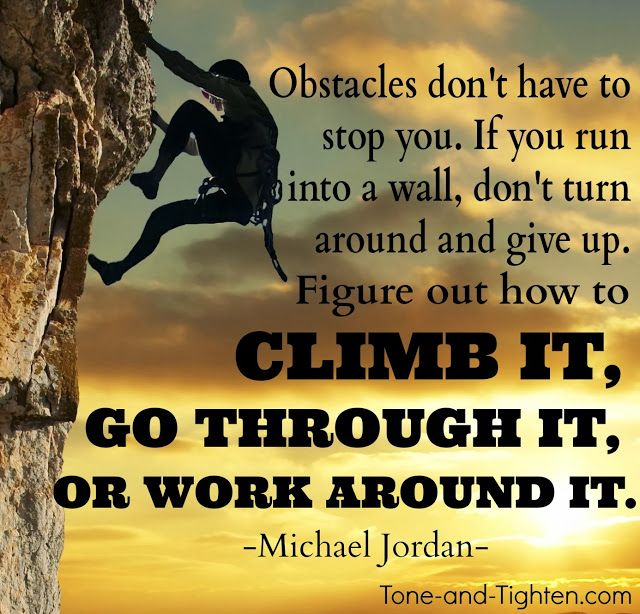

# Dale Duncan

## I am a veteran looking for a new career in the IT industry

## My goals for this Data Analytics Course

1. I want to learn and be proficient Python.
2. I want a career in the IT field/Data Analyist field.
3. I want to be succsessful and transition to a more healthy career versus physical labor.
4. I want to be able to grow and further my knowledge in the IT industry and continue learning.

### I found this article from hackernoon interesting, shows what skills you need to succeed as a Python dev/trends with a bunch of links to learn more about Python!
[Hackernoon's Article](https://hackernoon.com/what-do-companies-expect-from-python-devs-in-2019-f8b585a1ddf"Hackernoon_article")

]

#### The image above is insperational to me because life has many obsticals, it's up to you if you choose to give up, but if you keep pushing even on the days you do not want to you will inspire greatness and overcome yourself, I believe that the current program through Savvy Coders is the first step for me to land my dream career/field and be a better version of myself.