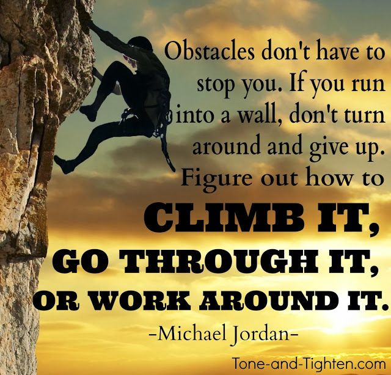

# Dale Duncan
## I am a Military veteran looking for a new Career in the IT industry

## Goals for my Data Analytics course
1. Become proficient in Python and Data Analytics
2. Start a career in Data Analytics
3. To become computer literate, and learn how to use software like excel, Tableau, and Python
4. To constantly challenge myself and learn new things in the IT world, to overcome any obsticals I might face

[Hackernoon-Article](https://hackernoon.com/what-do-companies-expect-from-python-devs-in-2019-f8b585a1ddf)
#### I found this article interesting because it shows how to succseed with Python and gives many resources via links to explore when starting my Python journey.

()

## This image inspires me by reminding me to always keep pushing no matter how hard it gets, if you continue to push during the hard times at the end of those moments you will be rewarded for not giving up and continuing to put your best effort in no matter the circumstance, my goal with this course is to learn python and data analytics, and afterwards continue to learn more programs/software in the IT field.